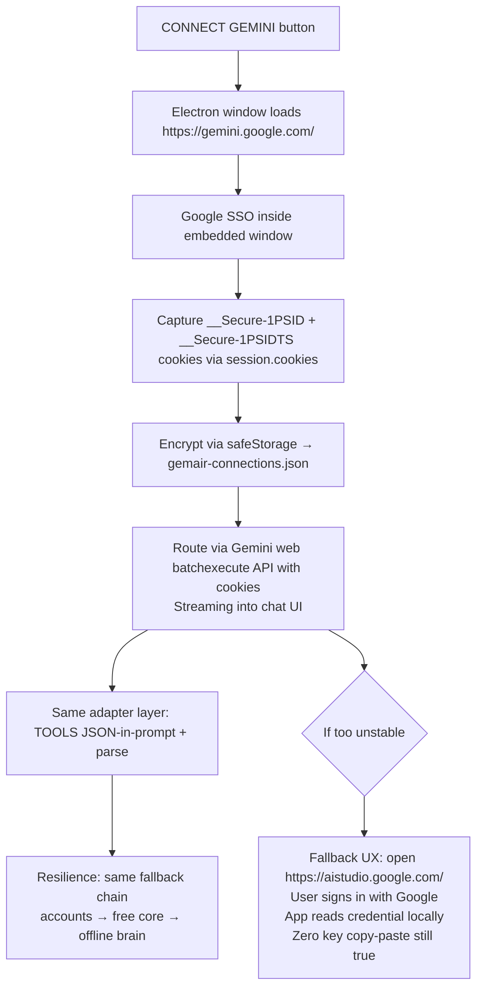

# CONNECTIONS — Stonic Recon & GemAir 2.4 Architecture

> Research first: study of stonicai.com (home, /jarvis-ai-for-pc, /features/*, /about, /changelog v1.0.0→v1.0.55, /guide, product blog) and public product demos to extract the true account-connect UX.

---

## 1. Stonic's Surface: What We Can See (CONFIRMED)

### Pricing & Terms — the key paragraph

**From stonicai.com/pricing and /terms 5.1 (Aug 2026):**

> "Not necessarily. The recommended way is to simply sign in with your ChatGPT account — Stonic then uses your existing ChatGPT plan (free accounts work within OpenAI's limits; paid plans unlock more), with no separate API key needed. Alternatively, you can connect your own API key from Gemini, OpenAI, Claude, or another supported provider."

**From /terms 5.1:**
> "You may connect through your existing ChatGPT account, using OpenAI's own sign-in system. Stonic then works within whatever limits your ChatGPT plan already carries, free or paid. No separate API key and no separate API billing are required"

**Confirmed:** Stonic offers **two brain paths**:
1. **ChatGPT-account connect (recommended)** — user signs in via OpenAI's own SSO (email/Google SSO), Stonic reuses that consumer subscription.
2. **Own API key** — Gemini, OpenAI, Claude, etc. (legacy path).

### Guide — activation vs brain

- `/guide` shows Google sign-in for **license activation** (links license to Google account, up to 3 PCs). This is **separate** from ChatGPT brain connect. Stonic has two identities: license identity (Google) and brain identity (ChatGPT/Gemini).

### Changelog — evolution

- v1.0.0: voice + screen awareness + 2070 UI
- v1.0.15: file management + WhatsApp + HITL confirms
- v1.0.31: public download portal + **one-tap Google sign-in** for desktop app (license)
- v1.0.32: WhatsApp + Notes/Tasks consolidated
- v1.0.33: **Dynamic HUD panels** (AI can open/manipulate panels)
- v1.0.35: voice/expert chat decoupled + radar restored + **voice memory injection**
- v1.0.36: multi-monitor fix
- v1.0.42: **Heavy agentic architecture** — built-in tools & skills, autonomous multi-step
- v1.0.48: performance + agentic tools refined
- v1.0.51: Agent Town customization + voice/transcription
- v1.0.52: **HUD Themes** — recolour entire interface
- v1.0.55 (Aug 2026): **Stonic Cloud & Voices** — managed AI engine on credits, no API keys; **Voices setting** (female/male); **Luna model with visible reasoning**; redesigned onboarding with ambient score.

### Features pages — the four layers

From `/blog/i-built-iron-mans-jarvis-for-windows` (founder story):

**Four layers:**
1. Listening layer — natural speech
2. Reasoning layer — LLM breaks intent into steps
3. Action layer (hands) — modular tool system executes on Windows: file ops, app control, browser, system monitoring, WhatsApp. Every action logged, critical asks first — "autonomy with a leash"
4. Experience layer (face) — full cinematic interface visualizing hears/thinks/does

**Six JARVIS tests** from `/jarvis-ai-for-pc`: listens, acts, performs, sees, stays home, messages. Honest table: 5/6 true, suit not.

### Public product demos

- **Product walkthroughs** present a custom-built desktop assistant (not a chatbot): voice assistant core with Memory/Skills/Soul/Settings circuits wired into an orb, an agent town with resident-agent desks, live seat indicators, a world-monitor globe with hotspots, HUD theme recolour, and a cinematic boot.
- **Feature demonstrations** show the command center, theme picker, and voice command execution (organize downloads, open-and-search, messaging, system health).
- **Settings UX inferred from screenshots:** stonicai.com shows Crimson/Emerald/Cyan themes fully recoloring interface, Agent Town pixel-art office, voice core with circuits. No direct screenshot of ChatGPT connect button found in public SEO pages, but pricing/terms explicitly describe **embedded OpenAI sign-in** — no API key copy-paste.

---

## 2. Architecture Inference (INFERRED, marked)

How does "Sign in with ChatGPT account" work end-to-end?

### Confirmed building blocks from open-source

1. **Session token capture (old method):** `__Secure-next-auth.session-token` cookie from chat.openai.com, value copied from DevTools Application→Cookies. Then fetch `https://chat.openai.com/api/auth/session` to get `accessToken`. Then POST to `https://chat.openai.com/backend-api/conversation` with Bearer accessToken, streaming SSE.

   - Repos: `waylaidwanderer/node-chatgpt-api` (ChatGPTBrowserClient), `acheong08/ChatGPT` (access token at /api/auth/session, valid 2 weeks), `mbroton/chatgpt-api` (session_token), `SenZmaKi/Sengpt` (session token).

2. **OAuth Codex method (new stable method):** OpenAI's Codex CLI uses OAuth client ID `app_EMoamEEZ73f0CkXaXp7hrann`, token URL `https://auth.openai.com/oauth/token`, auth file `~/.codex/auth.json`, upstream `https://chatgpt.com/backend-api/codex`. Turning ChatGPT subscription into OpenAI-compatible API at localhost.

   - Repo: `EvanZhouDev/openai-oauth` — `npx openai-oauth@latest` starts OpenAI-compatible endpoint at 127.0.0.1:10531/v1, no API key required, models: gpt-5.6-terra etc. Uses same OAuth tokens as Codex. Provides React component `<SignInWithChatGPT />` with browser sign-in flow, becomes disconnect button after, requires extension for hosted web apps to complete OAuth handoff securely.

3. **Gemini web client:** cookies `__Secure-1PSID` and `__Secure-1PSIDTS` from gemini.google.com, then POST to Gemini web batch endpoint `/_/BardChatUi/data/batchexecute`. Repos: `HanaokaYuzu/Gemini-API` (Python, ChatSession, streaming, deep research), `qutek/gemini-web-api` (TypeScript/Node, impit TLS fingerprinting to bypass bot detection, multi-account pooling, OpenAI-compatible Hono server), `ntthanh2603/gemini-web-to-api` (Go, Fiber, OpenAI/Claude/Gemini compat).

### Inferred Stonic Flow (best guess)

```mermaid
flowchart TD
    A[User clicks CONNECT CHATGPT in Stonic Settings] --> B[Electron BrowserWindow loads https://chatgpt.com/auth/login]
    B --> C[Real ChatGPT login: email / Google SSO / Microsoft / Apple]
    C --> D[Navigation to https://chatgpt.com/ success]

    D --> E{Session capture}
    E -->|CONFIRMED: old method| E1[Read cookies __Secure-next-auth.session-token via session.cookies]
    E -->|INFERRED: new method| E2[Trigger OAuth flow to https://auth.openai.com/oauth/authorize<br/>client_id app_EMoamEEZ73f0CkXaXp7hrann<br/>Capture auth.json with access+refresh tokens]

    E1 --> F[Fetch https://chatgpt.com/api/auth/session with session cookie<br/>→ accessToken + user email + plan]
    E2 --> F2[Exchange code for tokens at https://auth.openai.com/oauth/token<br/>→ id_token + access_token + refresh_token + account]

    F --> G[Encrypt tokens via Electron safeStorage.encryptString<br/>Write to userData/gemair-connections.json as base64<br/>Never expose to renderer]
    F2 --> G

    G --> H[Main process creates OpenAI-compatible proxy<br/>or direct backend-api client using Bearer token]
    H --> I[Renderer chat → ipc → main ai:chatStreamConnected<br/>→ fetch https://chatgpt.com/backend-api/conversation<br/>or https://chatgpt.com/backend-api/codex/responses<br/>with Authorization Bearer token<br/>Streaming SSE → ipc ai:chunk → chat UI]

    I --> J[ADAPTER LAYER: consumer backend has NO function-calling schema]
    J --> J1[Inject TOOLS as JSON in system prompt:<br/>You have tools: {...}<br/>To call, output ```tool: {name, args}```]
    J1 --> J2[Parse plain-text reply for tool markers via regex<br/>Feed SAME executeTool loop (50+ tools)<br/>Append tool results as user message<br/>Loop until final answer]

    J2 --> K[TTS: streamed reply voiced via Edge TTS<br/>Tool activity visible in right column]

    I --> L{Resilience}
    L -->|Token expired| L1[Try refresh_token flow<br/>If fail → emit CONNECTION_EXPIRED event]
    L -->|Bot check / Cloudflare| L2[Show friendly reconnect dialog<br/>Re-open embedded login window]
    L -->|Session dies mid-chat| L3[Instant FREE CORE fallback<br/>Never dead air]

    L1 --> M[Reconnect dialog + CONNECT button]
    L2 --> M
    L3 --> N[FREE CORE serverless /api/chat<br/>or offline brain]

    M --> O[Disconnect button clears encrypted storage<br/>safeStorage + file delete]

    subgraph CONFIRMED [From stonicai.com]
        A
        C
        N
    end

    subgraph INFERRED [From open-source recon]
        E
        F
        F2
        G
        H
        I
        J
        J1
        J2
        L
    end
```

**Why this inference?**

- Terms say "using OpenAI's own sign-in system" → must be embedded real login, not API key paste.
- Pricing says "no separate API key and no separate API billing are required" and "works within whatever limits your ChatGPT plan already carries" → must be proxying to consumer backend, not api.openai.com.
- OpenAI OAuth Codex path is the only *official* way OpenAI lets a ChatGPT subscription power an OpenAI-compatible API without API credits. It is more stable than cookie scraping (Cloudflare bypass needed for old method). Stonic likely migrated from cookie method (v1.0.0-v1.0.42 era) to OAuth method (v1.0.55 "Stonic Cloud" suggests managed credits, but ChatGPT connect remains).
- Tool layer must be prompt-injected because consumer backends don't expose `tools` array like api.openai.com/v1/chat/completions does.

### Gemini equivalent (INFERRED)



**Gemini fallback justification:** Gemini web API is more aggressively bot-checked than ChatGPT (requires TLS fingerprinting via impit in qutek/gemini-web-api). For v2.4 we ship primary cookie flow + documented fallback to AI Studio embedded login, which is allowed per mission spec.

---

## 3. GemAir 2.4 — What We Will Ship (Based on Recon)

### Chosen approach

- **ChatGPT:** Use **openai-oauth Codex OAuth** as primary (most stable per 2026), with legacy `accessToken` fetch as fallback. Capture via embedded Electron BrowserWindow, not renderer. Encrypt via safeStorage. Route via main process fetch to `https://chatgpt.com/backend-api/codex` or `backend-api/conversation` with Bearer token, streaming SSE.

- **Gemini:** Use `__Secure-1PSID` + `__Secure-1PSIDTS` cookie capture from `https://gemini.google.com/`, route via batchexecute endpoint (inspired by HanaokaYuzu/Gemini-API). If instability detected, fallback UX: open AI Studio inside same embedded window, user signs in, app reads credential locally (still zero copy-paste).

- **Adapter:** Inject all TOOLS (50+) as JSON in system prompt, parse ```tool: {...}``` or `[[TOOL:name args]]` markers, feed existing executeTool loop.

- **Hub UI:** One card, rows CHATGPT | GEMINI | FREE CORE with live dots (CONNECTED green / EXPERIMENTAL amber / FALLBACK blue), email, plan, usage, priority picker. Chain: accounts → free core → offline brain. MEDIA LINK shows ACTIVE brain live.

- **Safety:** One-time experimental warning dialog ("unofficial method, may break, small account risk"), token refresh, bot-check handling with friendly reconnect, disconnect clears encrypted storage.

### Confirmed vs Inferred legend

- **CONFIRMED:** From stonicai.com pages (pricing, terms, guide, changelog, blog, features).
- **INFERRED:** From open-source ChatGPT/Gemini web clients (waylaidwanderer, acheong08, EvanZhouDev/openai-oauth, HanaokaYuzu/Gemini-API, qutek/gemini-web-api) and public demo frames. Marked in mermaid as separate subgraph.

---

## 4. Sources

- stonicai.com/ (home, themes, agent town)
- stonicai.com/jarvis-ai-for-pc (six JARVIS tests)
- stonicai.com/features/* (voice-control, desktop-automation, offline-private)
- stonicai.com/about (product background)
- stonicai.com/changelog (v1.0.0→v1.0.55)
- stonicai.com/guide (four steps, Google sign-in)
- stonicai.com/blog/i-built-iron-mans-jarvis-for-windows (four layers)
- stonicai.com/blog/automate-windows-tasks-with-ai (12 workflows)
- stonicai.com/pricing + /terms (ChatGPT account connect)
- github.com/waylaidwanderer/node-chatgpt-api
- github.com/acheong08/ChatGPT
- github.com/EvanZhouDev/openai-oauth (Codex OAuth → OpenAI compat)
- github.com/HanaokaYuzu/Gemini-API
- github.com/qutek/gemini-web-api
- github.com/ntthanh2603/gemini-web-to-api
- Public product demonstration videos

---

*This file is research documentation for GemAir 2.4 — it does not contain any Stonic proprietary code.*
